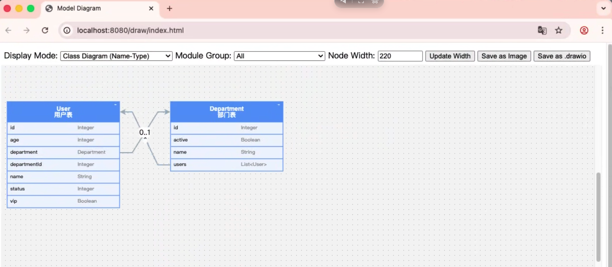

# 告别繁琐 XML：用 mybatis-dynamic 实现动态数据建模

> 作者：刘伟  

---

## 前言

作为 Java 开发者，你一定经历过这样的场景：

- 产品说"加个字段"，你要改实体类、改 Mapper XML、写 migration 脚本、重新部署...
- 想快速搭个原型验证想法，却被 ORM 配置耗去半天
- 做低代码平台，用户要动态建表，传统 ORM 直接"投降"

MyBatis 灵活，但 XML 配置繁琐；JPA 自动化，但不够灵活。有没有一种方案，既能享受"代码即模型"的便利，又保留 MyBatis 的灵活性？

**mybatis-dynamic** 就是这样一个尝试——基于 MyBatis 构建的动态 ORM 框架，让你用 Java 代码定义数据模型，框架自动处理建表、改表、查询，甚至直接暴露 REST API。

---

## 一、mybatis-dynamic 是什么

mybatis-dynamic 的核心理念是 **"模型即真相"（Model as Truth）**：

- 你用 Java 类定义数据模型
- 框架自动生成和维护数据库表结构
- 运行时可以动态修改模型
- 内置 Fluent API，告别 XML 和字符串拼接

它不是要取代 MyBatis，而是在 MyBatis 之上提供一层动态能力。适合快速原型、动态业务、低代码平台等场景。

**项目结构：**

```
mybatis-dynamic
├── core      # 核心引擎，可独立使用
├── spring    # Spring Boot Starter
├── draw      # 可视化模块
└── sample    # 示例项目
```

---

## 二、5 分钟快速上手

### 2.1 添加依赖

```xml
<dependency>
    <groupId>io.github.myacelw</groupId>
    <artifactId>mybatis-dynamic-spring</artifactId>
    <version>最新版本</version>
</dependency>
<!-- 数据库驱动，以 H2 为例 -->
<dependency>
    <groupId>com.h2database</groupId>
    <artifactId>h2</artifactId>
    <scope>runtime</scope>
</dependency>
```

### 2.2 配置

```yaml
spring:
  datasource:
    driver-class-name: org.h2.Driver
    url: jdbc:h2:./test;MODE=MySQL
    username: sa
    password:

mybatis-dynamic:
  update-model: true   # 启动时自动同步表结构
  table-prefix: t_     # 表名前缀
```

### 2.3 定义模型

```java
@Data
@FieldNameConstants
@Model(comment = "用户表")
public class User {

    @IdField
    private Integer id;

    @BasicField(ddlComment = "用户名", ddlNotNull = true)
    private String name;

    @BasicField(ddlComment = "年龄")
    private Integer age;
}
```

### 2.4 启用扫描

```java
@SpringBootApplication
@EnableModelScan(basePackages = "com.example.demo.model")
public class Application {
    public static void main(String[] args) {
        SpringApplication.run(Application.class, args);
    }
}
```

### 2.5 直接使用

```java
@RestController
@RequestMapping("/users")
public class UserController {

    @Autowired
    private BaseService<Integer, User> userService;

    @PostMapping
    public Integer create(@RequestBody User user) {
        return userService.insert(user);
    }

    @GetMapping
    public List<User> list() {
        return userService.query()
                .where(c -> c.gt(User.Fields.age, 18))
                .exec();
    }
}
```

**注意到了吗？**

- 没有 Mapper XML
- 没有手写 DDL
- 没有 `@Repository`
- `BaseService` 自动注入

启动应用，表自动创建，接口直接可用。

---

## 三、核心特性解析

### 3.1 动态 DDL：模型变了，表跟着变

这是 mybatis-dynamic 最核心的能力。设置 `update-model: true` 后：

- **加字段**：在 Java 类里加个属性，重启，数据库自动加列
- **加索引**：注解里加 `ddlIndex = true`，重启，索引自动创建
- **改注释**：修改 `ddlComment`，重启，字段注释同步更新

对比传统方式：

| 操作 | 传统方式 | mybatis-dynamic |
|------|----------|-----------------|
| 加字段 | 改实体 → 写 migration → 部署 | 改实体 → 重启 |
| 加索引 | 写 DDL 脚本 → 手动执行 | 加注解 → 重启 |
| 开发环境同步 | Flyway/Liquibase 配置 | 开箱即用 |

当然，生产环境仍建议配合数据库版本管理工具使用，但开发阶段的效率提升是实打实的。

### 3.2 Fluent Query API：写查询像写英语

告别字符串拼 SQL 的噩梦：

```java
userService.query()
    .select("id", "name", "department.name")  // 自动 JOIN
    .where(c -> c.eq("status", 1)
                 .and(sub -> sub.gt("age", 18)
                                .or()
                                .eq("vip", true)))
    .orderByDesc("createdAt")
    .limit(10)
    .exec();
```

**亮点：**

- **自动处理优先级**：`AND` 优先于 `OR`，不用手动加括号
- **自动 JOIN**：选择关联字段时自动触发 LEFT JOIN
- **类型安全**：配合 Lombok 的 `@FieldNameConstants`，告别魔法字符串
- **Optional 条件**：`eqOptional("name", name)` 当 name 为空时自动忽略

### 3.3 关系映射：@ToOne / @ToMany

```java
@Model
public class Order {
    @IdField
    private Integer id;
    
    // 需要显式定义外键字段
    @BasicField
    private Integer userId;

    @ToOne
    private User user;  // 自动识别 userId 作为外键
    
    @ToMany
    private List<OrderItem> items;  // 自动识别 orderId
}
```

查询时自动处理关联：

```java
// 自动关联
orderService.query()
    .select("id", "user.name", "items.productName")
    .exec();

// 显式关联 (v0.1.1+)
orderService.query()
    .joins(
        Join.inner("user")
            .on(c -> c.eq("active", true))
    )
    .exec();
```

还支持：
- 多对多（通过中间表）
- 递归关系（树形结构）
- 自定义 JOIN 条件

### 3.4 零代码 REST API

启动即拥有完整 CRUD 接口：

| 端点 | 说明 |
|------|------|
| `GET /api/dynamic/{model}` | 分页查询，支持 `?name=John&page=1&size=10` |
| `GET /api/dynamic/{model}/{id}` | 按 ID 查询 |
| `POST /api/dynamic/{model}` | 新增 |
| `PUT /api/dynamic/{model}` | 更新 |
| `DELETE /api/dynamic/{model}/{id}` | 删除 |

适合：
- 快速原型验证
- 管理后台
- 低代码平台后端

不需要可以关闭：
```yaml
mybatis-dynamic:
  rest:
    enabled: false
```

### 3.5 运行时动态扩展字段

这是杀手级特性，让实体实现 `ExtBean` 接口：

```java
@Model
public class User implements ExtBean {
    @IdField
    private String id;
    private String name;

    @IgnoreField
    private Map<String, Object> ext = new HashMap<>();

    @Override
    public Map<String, Object> getExt() {
        return ext;
    }
}
```

然后可以在运行时添加字段：

```java
// 1. 获取模型定义
Model userModel = modelService.getModelForClass(User.class);

// 2. 添加新字段
userModel.getFields().add(Field.string("phone", 100));
modelService.updateAndRegister(userModel);  // 自动执行 ALTER TABLE 并注册

// 3. 使用新字段
User user = new User();
user.getExt().put("phone", "13800138000");
userService.insert(user);

// 4. 查询也没问题
List<User> users = userService.query()
    .where(c -> c.eq("phone", "13800138000"))
    .exec();
```

这对 SaaS 多租户、动态表单等场景是救命稻草。

### 3.6 可视化模型设计 (Draw)

不仅是代码，mybatis-dynamic 还内置了 **Draw** 模块，能实时将你的 Java 模型代码渲染为交互式 ER 图。

**依赖引入：**
```xml
<dependency>
    <groupId>io.github.myacelw</groupId>
    <artifactId>mybatis-dynamic-draw</artifactId>
    <version>最新版本</version>
</dependency>
```

启动应用后访问 `/draw/index.html`，即可看到当前系统的全量数据模型关系图。



这对梳理复杂业务关系、生成设计文档非常有帮助，且完全无需额外维护，代码即图表。

### 3.7 企业级权限控制 (Row/Column Level Security)

在 B 端系统中，数据权限往往比功能权限更复杂。mybatis-dynamic 内置了**行级**和**列级**权限控制接口，且对业务代码完全透明。

只需实现 `PermissionGetter` 接口并注入 Spring 容器：

```java
@Component
public class MyPermissionGetter implements PermissionGetter {
    @Override
    public Permission getPermission(Model model) {
        // 1. 列权限：只允许查看部分字段 (e.g. 隐藏手机号、薪资)
        List<String> allowedFields = Arrays.asList("id", "name", "department");
        
        // 2. 行权限：只能查看自己部门的数据
        Condition dataScope = Condition.builder()
                .eq("department_id", CurrentUser.getDeptId())
                .build();
                
        return new Permission(allowedFields, dataScope);
    }
}
```

配置生效后：
- **查询时**：自动在 SQL 中注入 `AND department_id = ?` 条件，且 `SELECT` 子句自动过滤未授权字段。
- **更新时**：同样受行级权限约束，防止越权修改。
- **前端适配**：API 返回的数据结构会自动剔除无权限字段，前端无需特殊处理。

---

## 四、适用场景与边界

### ✅ 推荐场景

1. **快速原型开发**：几分钟搭建一个可用的后端
2. **内部管理系统**：不需要极致性能，需要快速迭代
3. **低代码/动态表单平台**：运行时扩展字段能力是刚需
4. **多租户 SaaS**：每个租户可以有自定义字段

### ⚠️ 需要权衡

1. **超高并发核心系统**：动态能力有运行时开销，建议配合缓存
2. **已有成熟 MyBatis 项目**：迁移需要评估成本
3. **需要极致 SQL 控制**：复杂报表查询可能还是手写 SQL 更合适

### 与 MyBatis-Plus 的定位差异

| 维度 | MyBatis-Plus | mybatis-dynamic |
|------|--------------|-----------------|
| 定位 | MyBatis 增强工具 | 动态 ORM 框架 |
| 动态建模 | ❌ | ✅ |
| 运行时改表 | ❌ | ✅ |
| 零代码 REST | ❌ | ✅ |
| 代码生成 | ✅（需要先建表） | ❌（不需要） |
| 生态成熟度 | ⭐⭐⭐⭐⭐ | ⭐⭐（成长中） |

两者不是替代关系，而是互补。mybatis-dynamic 适合"从代码到表"的场景，MyBatis-Plus 适合"表已存在"的场景。

---

## 五、未来规划

项目还在积极迭代，计划中的特性包括：

- 🔄 提供 Agent SKILL
- 🗄️ 更多数据库方言（目前已支持 MySQL、PostgreSQL、Oracle、OceanBase、H2）
- 🎨 可视化模型设计器
- 🔌 与主流低代码平台集成

---

## 结语

mybatis-dynamic 不是银弹，它解决的是特定场景下的特定痛点：**当你需要数据模型具备动态能力时，传统 ORM 的僵化就成了绊脚石**。

如果你正在做需要动态扩展的系统，或者厌倦了每次加字段都要改一堆文件，不妨试试。项目开源在 GitHub，欢迎 Star、Issue 和 PR：

👉 **https://github.com/myacelw/mybatis-dynamic**

---

*作者简介：刘伟，资深 Java 开发者，专注于企业级应用架构。mybatis-dynamic 项目作者。*
